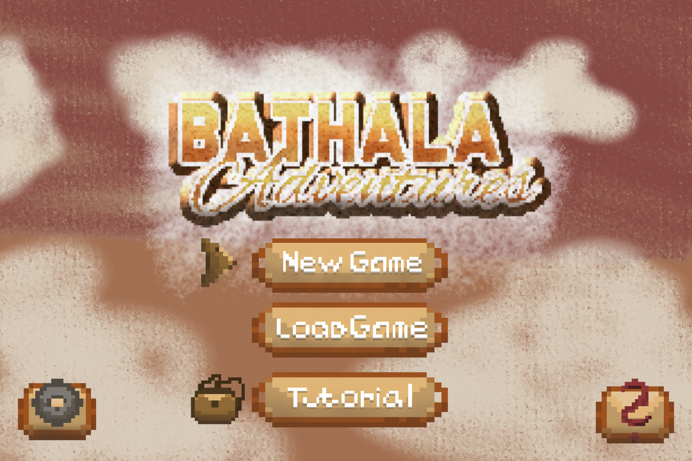
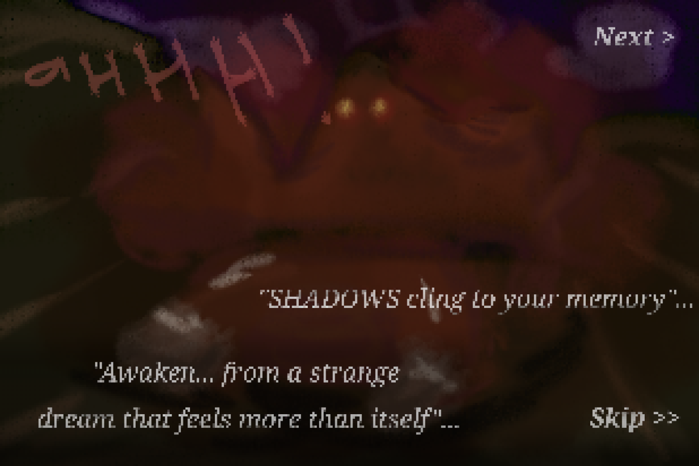
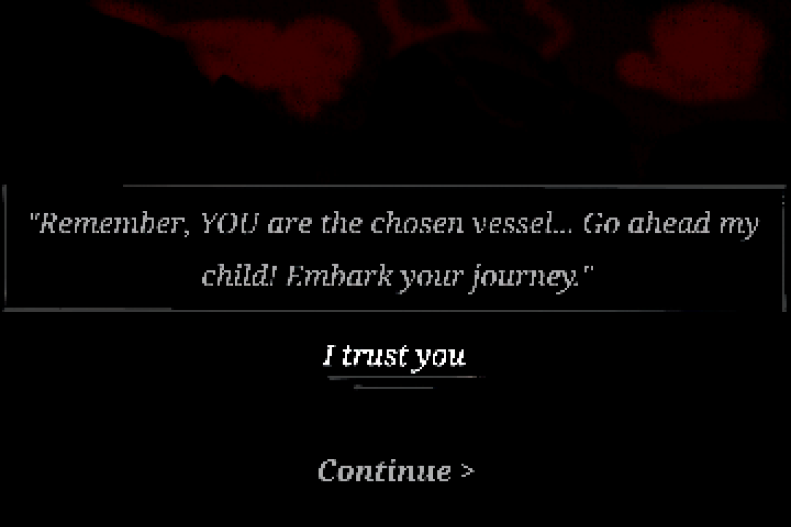
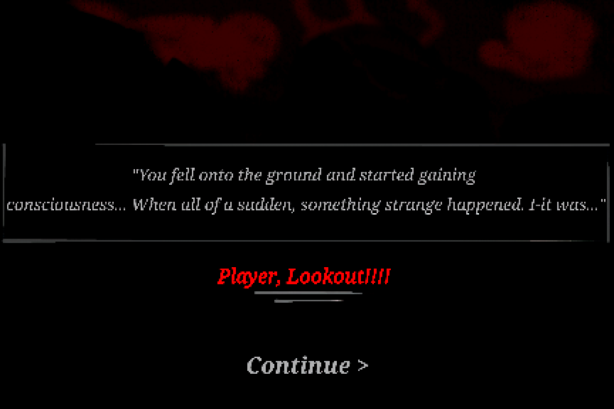
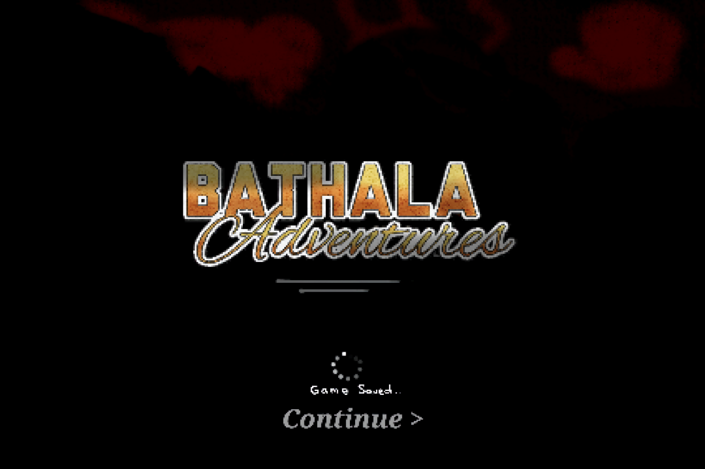
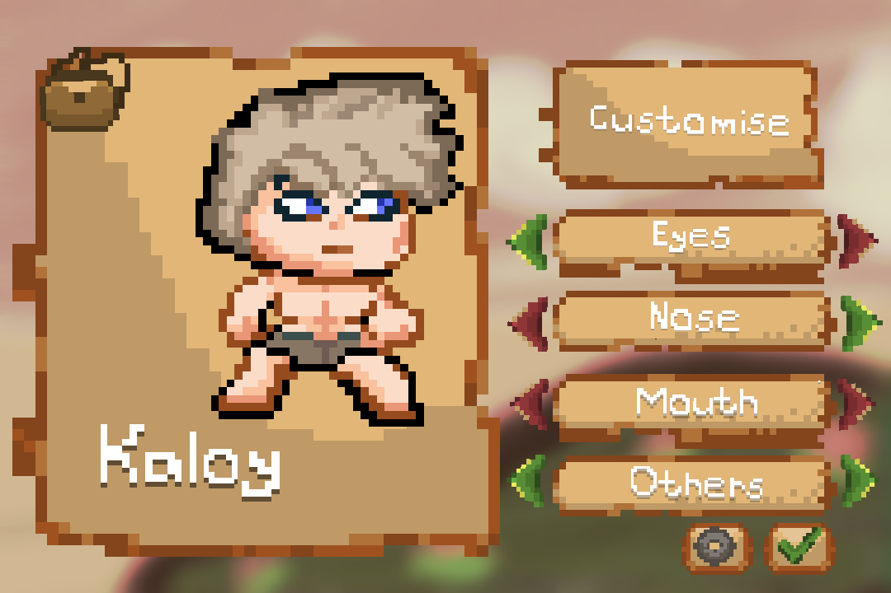

  <h1 align="center"> Bathala Adventures (An RPG-Adventure Game) </h1>

  

 
  
 <b> A Philippine myth-inspired survival Top-Down RPG where strategy and emotions shape your fate and the will of the god decides your path.

Awaken from a strange dream only to discover the legends are real. In BATHALA, you journey through a dark, folklore-rich world haunted by Philippine mythical creatures like the Aswang, Duwende, Tikbalang and etc... Manage your health, strength, food, and mood as you fight to survive—and ascend. 

You are not just a player. You are a vessel—guided by the unseen will of Bathala, the god who shapes your fate. Your survival depends on understanding his signs, enduring trials, and proving you're worthy of the power you've been entrusted with. 

Customize your character, forge your path, and uncover the truth behind a mysterious ancient book guarded by an all-seeing eye. Armed with only your instincts, a fragile wooden cross, and a sarcastic cat companion, you'll face bosses whose power is tied to the red moon, time of day, and even your own emotional state. 
   </b> 

 

   

 <b> <i> Can you stay strong, keep your spirit intact, and uncover what it truly means to become Bathala?
</i> </b> 

 

<h1 align="center"> Game Developers </h2>

    Tarun, Ija Iriel  
    <b> <i> Lead Designer, Game Director, & Creative Director </b> </i>  
    Breis, Jasper Miguel  
      <b> <i> Lead Programmer </b> </i>  
    Kagahastian, Zet Emerson  
    <b> <i> Gameplay Programmer & AI Programmer </b> </i>  
    Clarion, Zairiel </b>  
    <b> <i> Graphics/Rendering Programmer </b ></i>
     

<h2 align="center"> We are the Computer Science students from National University - Laguna </h2>

  

    

      ====== <b> TABLE OF CONTENTS </b> ======
    

  

  

  [Key Features](#key-features)  
  [Installation](#installation)  
  [How to Play](#how-to-play)  
  [Screenshots](#screenshots)  
  [Future Plans](#future-plans)  

  

<h2 align="center"> ..... </h2>

<h1 align="center"> About/Story </h1>

 <i> You are chosen. Not as a mere wanderer, but as a vessel of Bathala, the unseen god who
shapes all fates. His will flows through you… to guide, to test, to forge your spirit in the fires
of trial. </i> 
 

 <i> Only by enduring his signs, surviving the trials ahead, and proving yourself… shall
you hold the power entrusted to you.... </i> 

<h2 align="center"> ..... </h2>

### Screenshots

<h2 align="center"> ..... </h2>

### Key Features

<i> (Customization) </i>
> Kaloy (Male Protagonist)

> Marga (Female Protagonist)

(Emotion Bar)

> The challenges of the game are simple, manage your character's health and strength, but to add something unique, the developers wanted to add an "emotion bar" in which the character's mood goes up and down and gives buffs and debuffs to the character.

### How does this feature work?
> The "saddened" state makes it harder for the player to battle foes as he/she is given debuffs that could hinder their battle with their enemies. The "neutral" state is the normal mood of the character no buffs and debuffs. The "Motivated" state gives the character a buff that could help them battle their enemies easier. And lastly, the "Rage" state, the state in which the character enters a sudden burst of strength, speed, and other buffs that could help the player progress through his/her enemies even faster but this state drains your health and strength after a period of time so be careful when to use it.

### Installation (soon...)
As of now, it will be available on Windows/PC

### How to Play? (soon...)
We'll drop it here ;>

### Future Plans (soon...)
We are planning to make it cross-platform so that everyone can play
