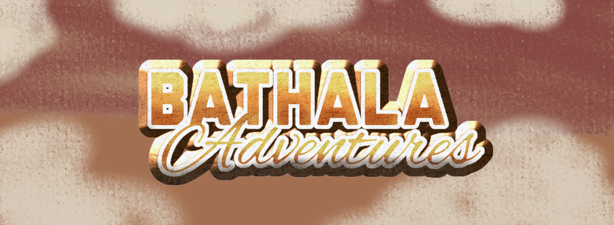
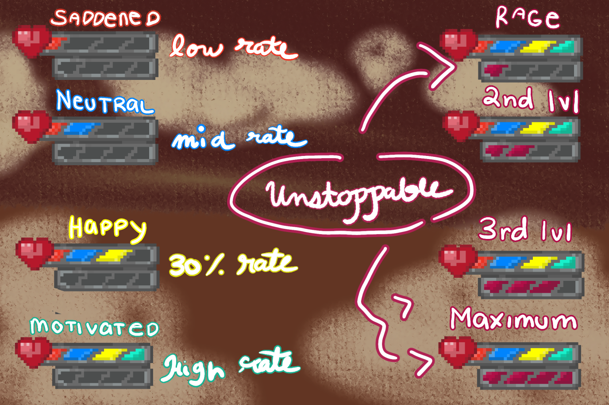

  <h1 align="center"> Bathala Adventures (An RPG-Adventure Game) </h1>

 
  
 <b> A Philippine myth-inspired survival Top-Down RPG where strategy and emotions shape your fate and the will of the god decides your path.

Awaken from a strange dream only to discover the legends are real. In BATHALA, you journey through a dark, folklore-rich world haunted by Philippine mythical creatures like the Aswang, Duwende, Tikbalang and etc... Manage your health, strength, food, and mood as you fight to survive—and ascend. 

You are not just a player. You are a vessel—guided by the unseen will of Bathala, the god who shapes your fate. Your survival depends on understanding his signs, enduring trials, and proving you're worthy of the power you've been entrusted with. 

Customize your character, forge your path, and uncover the truth behind a mysterious ancient book guarded by an all-seeing eye. Armed with only your instincts, a fragile wooden cross, and a sarcastic cat companion, you'll face bosses whose power is tied to the red moon, time of day, and even your own emotional state. 
   </b> 

 

   

 <b> Can you stay strong, keep your spirit intact, and uncover what it truly means to become Bathala?
   </b> 

 

<h1 align="center"> TABLE OF CONTENTS </h1>

  

    

      >>> <b> FOR A BETTER AND QUICK NAVIGATION, CLICK TO EXPAND </b> <<<
    

  

  

  [Key Features](#key-features)  
  [How does this feature work?](#how-does-this-feature-work)  
  [Installation](#installation)  
  [How to Play](#how-to-play)  
  [Screenshots](#screenshots)  
  [Future Plans](#future-plans)  

  

<h2 align="center"> Game Dev Team </h2>

  <b> Tarun, Ija Iriel </b>  
  <b> Breis, Jasper Miguel  
    <b> Kagahastian, Zet Emerson  
  <b> Clarion, Zairiel </b>

### Key Features
Emotion Bar (Feature)

> The challenges of the game are simple, manage your character's health and strength, but to add something unique, the developers wanted to add an "emotion bar" in which the character's mood goes up and down and gives buffs and debuffs to the character.

### How does this feature work?
> The "saddened" state makes it harder for the player to battle foes as he/she is given debuffs that could hinder their battle with their enemies. The "neutral" state is the normal mood of the character no buffs and debuffs. The "Motivated" state gives the character a buff that could help them battle their enemies easier. And lastly, the "Rage" state, the state in which the character enters a sudden burst of strength, speed, and other buffs that could help the player progress through his/her enemies even faster but this state drains your health and strength after a period of time so be careful when to use it.

### Installation

### How to Play?

### Screenshots

### Future Plans

### Author
